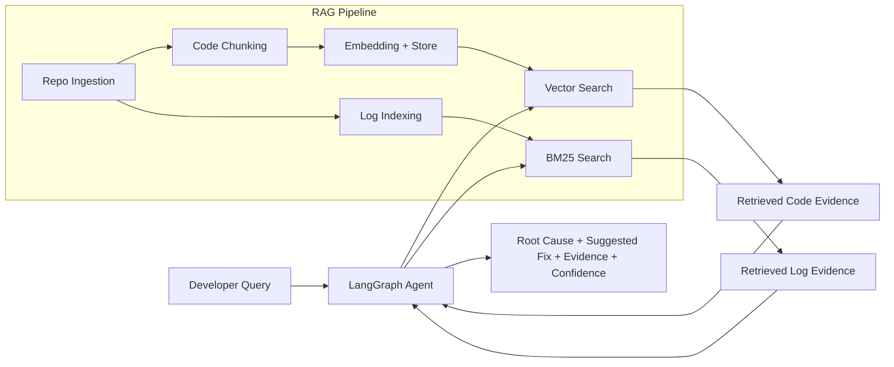

# CodeRAG

An AI-powered debugging assistant that reads repositories, retrieves relevant code and logs, and generates structured root-cause analysis with suggested fixes.

CodeRAG combines:
- Repository ingestion + smart code chunking
- Vector search (ChromaDB) + keyword log search (Elasticsearch)
- Multi-step reasoning using a LangGraph agent loop

## Table of Contents

1. [Overview](#overview)
2. [Why CodeRAG](#why-coderag)
3. [Core Features](#core-features)
4. [Architecture](#architecture)
5. [Project Structure](#project-structure)
6. [Tech Stack](#tech-stack)
7. [Quick Start](#quick-start)
8. [Configuration](#configuration)
9. [How It Works](#how-it-works)
10. [Testing](#testing)
11. [Current API Surface](#current-api-surface)
12. [Roadmap](#roadmap)
13. [Troubleshooting](#troubleshooting)
14. [Contributing](#contributing)
15. [License](#license)

## Overview

CodeRAG is a backend-first system for AI-assisted debugging.

It is designed to answer questions like:
- "Why is this login flow failing?"
- "Which file likely causes this error?"
- "What is the most probable root cause and fix?"

Instead of plain text generation, CodeRAG grounds reasoning in code and logs retrieved from your target repository.

## Why CodeRAG

Most debugging assistants are either:
- Semantic only (good at code similarity, weak at log evidence), or
- Keyword only (good at logs, weak at semantic code relationships)

CodeRAG uses both retrieval styles and then reasons iteratively:
- Semantic evidence from code embeddings
- Keyword evidence from log indexing
- Confidence-guided loop to refine hypotheses before producing the final answer

## Core Features

### 1) Repository Ingestion
- Clones public GitHub repositories
- Traverses source files while skipping noisy directories
- Extracts structured chunks from supported languages

### 2) Smart Chunking
- AST-based chunking for Python (functions/classes)
- Block-based chunking for other supported languages
- Metadata-rich chunks (file path, lines, symbol name, language)

### 3) Dual Retrieval Engine
- ChromaDB for vector similarity search over code chunks
- Elasticsearch (BM25) for log-line keyword search
- Unified retrieval context output

### 4) Reasoning Agent (LangGraph)
- Node pipeline: Retrieve -> Analyze -> Verify -> Decide -> Respond
- Iterative hypothesis refinement loop
- Confidence scoring based on overlap, evidence depth, and iteration bonus
- Structured final response with root cause, suggested fix, and evidence

### 5) Containerized Local Stack
- Docker Compose orchestration
- MySQL + ChromaDB + Elasticsearch + FastAPI backend
- Persistent volumes for models and cloned repositories

## Architecture



## Project Structure

```text
CodeRag-Project/
|- backend/
|  |- app/
|  |  |- main.py                 # FastAPI app + /health
|  |  |- config.py               # Environment settings
|  |  |- database.py             # SQLAlchemy setup
|  |  |- models/                 # User + query history models
|  |  |- services/               # Ingestion, embeddings, retrieval, agent logic
|  |  |- utils/chunker.py        # AST and block chunking
|  |- tests/
|  |  |- test_phase2.py          # Data pipeline validation
|  |  |- test_phase3.py          # Reasoning agent validation
|  |- Dockerfile
|  |- requirements.txt
|- docs/
|- frontend/                     # Placeholder for UI work
|- docker-compose.yml
|- .env.example
|- README.md
```

## Tech Stack

**Backend & API**
- FastAPI
- SQLAlchemy

**AI & Reasoning**
- sentence-transformers (MiniLM query embeddings)
- CodeBERT (code embeddings)
- FLAN-T5 (hypothesis/fix generation)
- LangGraph

**Retrieval & Storage**
- ChromaDB (vector store)
- Elasticsearch (BM25 log search)
- MySQL (application metadata)

**Infra**
- Docker + Docker Compose

## Quick Start

### Prerequisites
- Docker Desktop (or Docker Engine + Compose plugin)
- At least 8 GB RAM recommended
- Stable internet connection (first run downloads ML models)

### 1) Clone and configure

```bash
git clone https://github.com/snehas-05/CodeRag-Project.git
cd CodeRag-Project
cp .env.example .env
```

### 2) Build and run services

```bash
docker compose up --build -d
```

### 3) Verify system health

```bash
curl http://localhost:8000/health
```

Expected response:

```json
{"status":"ok","service":"coderag"}
```

## Configuration

Environment variables are managed via `.env` (see `.env.example`).

| Variable | Description | Default |
|---|---|---|
| `MYSQL_ROOT_PASSWORD` | MySQL root password | `rootpassword` |
| `MYSQL_DATABASE` | App database name | `coderag` |
| `MYSQL_USER` | App database user | `coderag_user` |
| `MYSQL_PASSWORD` | App database password | `coderag_pass` |
| `MYSQL_URL` | SQLAlchemy connection URL | `mysql+pymysql://...` |
| `SECRET_KEY` | App secret key | `your-secret-key-change-in-production` |
| `JWT_ALGORITHM` | JWT algorithm | `HS256` |
| `ACCESS_TOKEN_EXPIRE_MINUTES` | JWT expiry window | `30` |
| `CHROMA_HOST` | Chroma host (inside Compose network) | `chromadb` |
| `CHROMA_PORT` | Chroma port (inside Compose network) | `8000` |
| `ELASTICSEARCH_URL` | Elasticsearch URL | `http://elasticsearch:9200` |
| `MODEL_CACHE_DIR` | Local model cache directory | `/app/model_cache` |
| `REPOS_DIR` | Cloned repositories directory | `/app/repos` |

## How It Works

### Phase 1: Foundation
- FastAPI service bootstraps and initializes SQL tables
- Core infra components are connected through Docker Compose

### Phase 2: Retrieval Pipeline
1. Clone repository from GitHub
2. Chunk source files into searchable units
3. Embed and store code chunks in ChromaDB
4. Index log lines in Elasticsearch
5. Retrieve unified context from vector + BM25 search

### Phase 3: Reasoning Agent
1. **Retrieve**: gather evidence chunks
2. **Analyze**: generate a hypothesis
3. **Verify**: compute confidence and extract supporting evidence
4. **Decide**: loop or finalize based on threshold/iteration cap
5. **Respond**: produce structured debugging output

Typical output shape:

```json
{
	"root_cause": "...",
	"suggested_fix": "...",
	"evidence": [
		{
			"file_path": "...",
			"start_line": 10,
			"end_line": 22,
			"content": "...",
			"name": "..."
		}
	],
	"confidence": 0.78,
	"iterations": 2,
	"hypothesis_chain": ["...", "..."]
}
```

## Testing

Run tests inside the backend container.

### Phase 2 tests

```bash
docker compose exec backend python tests/test_phase2.py
```

Checks model loading, embedding, chunking, ChromaDB/Elasticsearch connectivity, and full retrieval flow.

### Phase 3 tests

```bash
docker compose exec backend python tests/test_phase3.py
```

Checks state initialization, node behavior, routing, confidence scoring, and full agent execution.

## Current API Surface

At this stage, the exposed route is:
- `GET /health`

Planned next routes include ingestion/query endpoints that will wrap the Phase 2 + Phase 3 services.

## Roadmap

- Add production-ready API routes for ingestion and debugging query workflows
- Persist full query/response lifecycle in database history
- Introduce authentication-protected debugging sessions
- Build frontend UI for repository onboarding and interactive debugging
- Add quality gates (unit/integration benchmarks, retrieval quality checks)

## Troubleshooting

### Backend starts slowly on first run
Large model downloads are expected the first time. Keep containers running to preserve cache volumes.

### Elasticsearch or ChromaDB retrieval returns empty
Ensure repository ingestion and indexing finished successfully before querying.

### Phase 3 tests fail with sparse evidence
Run Phase 2 tests first so test data is seeded in vector/log stores.

### Dependency mismatch in container
Rebuild backend image:

```bash
docker compose up --build -d backend
```

## Contributing

Contributions are welcome.

1. Fork the repository
2. Create a feature branch
3. Add/update tests for your changes
4. Open a pull request with a clear summary

## License

This project is licensed under the terms in the `LICENSE` file.