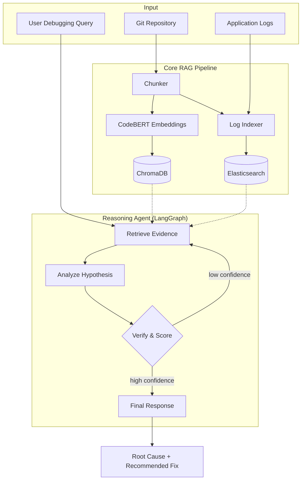

# 🛡️ CodeRAG: AI-Powered Autonomous Debugging

[](https://opensource.org/licenses/MIT)
[](https://www.python.org/downloads/release/python-3110/)
[](https://www.docker.com/)

**CodeRAG** is an intelligent debugging assistant that autonomously bridges the gap between semantic code understanding and keyword-driven log analysis. By combining high-density code chunking with a multi-node reasoning loop, CodeRAG moves beyond simple text generation to provide grounded, evidence-based root cause analysis and suggested fixes.

---

## 🚀 Quick Start (Docker Orchestrated)

The easiest way to get CodeRAG running is via our unified management scripts.

### 1. Requirements
- **Docker Desktop** (or Docker Engine + Compose plugin)
- **8 GB RAM** minimum (16 GB highly recommended)
- **10 GB Disk Space** (for ML models and vector data)

### 2. Automatic Setup
```bash
# Clone the repository
git clone https://github.com/snehas-05/CodeRag-Project.git
cd CodeRag-Project

# Run the guided setup script (detects environment, builds, and starts containers)
./scripts/setup.sh
```

### 3. Verify Health
```bash
# Using the Makefile
make health

# Or using the verification script
./scripts/verify.sh
```

---

## 🏗️ System Architecture

CodeRAG leverages a **Retrieval-Augmented Generation (RAG)** pipeline integrated with a **LangGraph Reasoning Agent**.

### Concept Flow
1.  **Ingestion**: Clones repositories and performs AST-aware chunking for Python and block-based chunking for other languages.
2.  **Dual Indexing**:
    *   **ChromaDB**: Stores semantic embeddings for code blocks (using CodeBERT).
    *   **Elasticsearch**: Indexes raw log lines for high-speed keyword retrieval.
3.  **Agent Loop**: A multi-step reasoning agent (Retrieve → Analyze → Verify → Decide) that iteratively refines its hypothesis until a confidence threshold is met.



---

## 🛠️ Management & Automation

We provide a `Makefile` and a `scripts/` directory to simplify daily operations.

### Makefile Commands
| Command | Action |
| :--- | :--- |
| `make up` | Start full stack (detached) |
| `make down` | Stop all services |
| `make logs` | Stream logs from all containers |
| `make health` | Quick check of API and UI endpoints |
| `make test` | Run core reasoning & retrieval test suites |
| `make clean` | Factory reset (removes containers & volumes) |

---

## 🧩 Technical Stack

- **Backend Framework**: [FastAPI](https://fastapi.tiangolo.com/) (Async Python 3.11)
- **Vector Database**: [ChromaDB](https://www.trychroma.com/)
- **Search Engine**: [Elasticsearch 8.x](https://www.elastic.co/) (Keyword/BM25)
- **Relational Data**: [MySQL 8.0](https://www.mysql.com/)
- **AI/ML Orchestration**: [LangChain](https://www.langchain.com/) + [LangGraph](https://langchain-ai.github.io/langgraph/)
- **Embeddings**: `sentence-transformers` (MiniLM) and `CodeBERT`
- **LLM Reasoning**: `FLAN-T5` (for autonomous hypothesis synthesis)

---

## 📍 Roadmap

- [ ] **Interactive UI**: Full React dashboard for repository management and chat-based debugging.
- [ ] **Session Persistence**: Persistent storage for all debugging sessions and reasoning chains.
- [ ] **Multi-Language AST Support**: Enhanced chunking for JavaScript/TypeScript and Java.
- [ ] **Advanced Filtering**: Filter evidence by specific time ranges in logs or specific directory branches.
- [ ] **CI/CD Integration**: Automated debugging reports triggered by failed CI pipelines.

---

## ⚠️ Important Notes

> [!NOTE]
> **First Run Performance**: On the first start, the backend container will download approximately **2 GB** of pre-trained models. This may take several minutes depending on your internet connection.

> [!WARNING]
> **Hardware Compatibility**: Apple Silicon users should ensure Docker Desktop has "Use Rosetta for x86/amd64 emulation" enabled for optimal performance of some ML components.

---

## 📜 License

This project is licensed under the MIT License - see the [LICENSE](LICENSE) file for details.